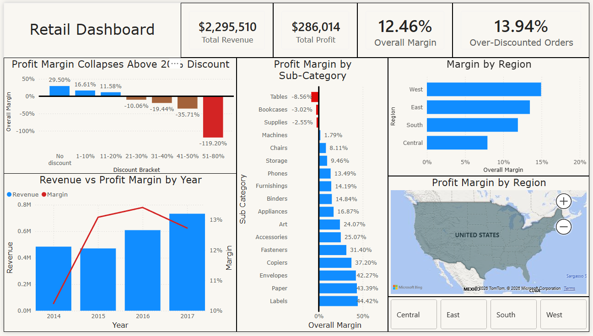

# 🛒 Retail Profit Diagnosis

**The problem:** Revenue grew 51% from 2014 to 2017 but profit margins are shrinking. Why?

Analysis of 9,986 retail orders to identify the root cause and quantify the financial impact.

## Key findings

- **The tipping point is 20% discount.** Orders below this threshold average 17-34% margin; above it, 91%+ of orders lose money
- **13.9% of orders are over-discounted.** These 1,392 orders destroyed \$135,364 in profit while the rest of the business generated \$421,378
- **Tables and Bookcases lose money on average.** Average discounts of 26% push both sub-categories into negative margin territory
- **The Central region has the lowest margin (7.9%) and the highest average discount.** The correlation is direct
- **Capping discounts at 20%** across Furniture could recover an estimated \$80,000 – \$100,000 in annual profit


## Retail Dashboard




## How to run

```bash
pip install -r requirements.txt

python data_cleaning.py                 # clean raw data → superstore_clean.csv + superstore.db
jupyter notebook retail_analysis.ipynb  # full analysis: SQL + EDA + findings
```

Open `Retail_Dashboard.pbix` in Power BI Desktop to explore the interactive dashboard.


## Project structure

```
├── data_cleaning.py            # ETL pipeline with audit trail
├── retail_analysis.ipynb       # Full analysis notebook
├── Retail_Dashboard.pbix       # Power BI dashboard
├── requirements.txt            # Python dependencies
└── data/
    └── superstore_raw.csv      # Raw data source
```

## Data source
[Sample Superstore Dataset](https://www.kaggle.com/datasets/vivek468/superstore-dataset-final) — Kaggle
